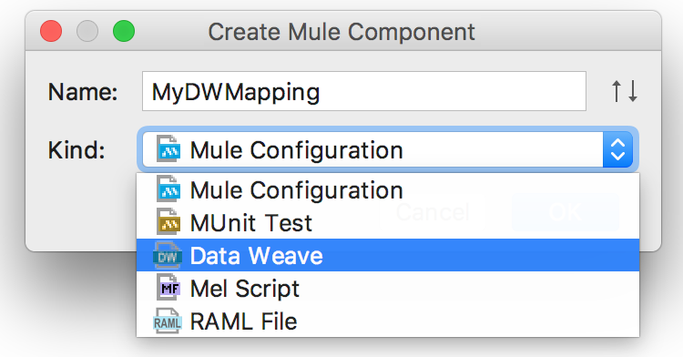
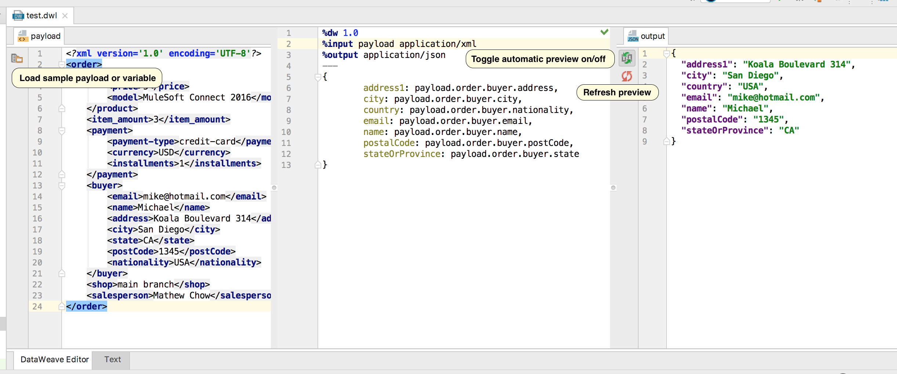
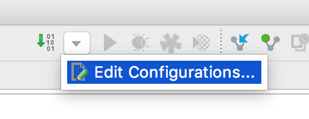
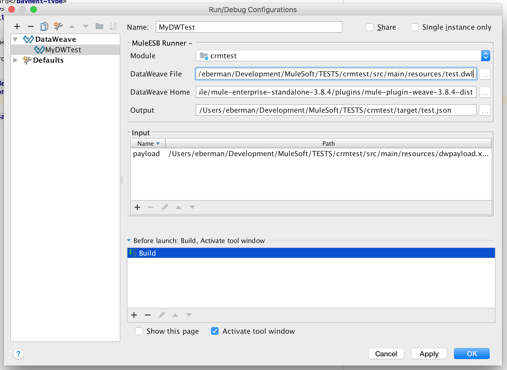

# DataWeave plugin for IntelliJ IDEA
**version 0.11**

[Features](#features)

[Installation](#installation)

[Creating DataWeave files](#creating-dataweave-files)

[Run/Debug configurations](#rundebug-configurations)

## Features
- Live preview
- Syntax highlighting and auto completion
- Run/Debug DataWeave

## Installation
To download and install DataWeave plugin:
1. Open the IntelliJ **Settings** dialog
2. In the left-hand pane, select **Plugins**
3. Click the **Browse Repositories...** button
4. Search for **DataWeave Plugin for IntelliJ** and click the **Install** button

> NOTE: if you have **[Mule ESB plugin](https://github.com/machaval/mule-intellij-plugins/tree/master/mule-esb-plugin)** installed, most likely you already have the DataWeave plugin installed as well.

## Creating DataWeave files
1. Right-click on a folder in the **Project** view and select **New | Mule Component** in the context menu, or select **File | New | Mule Component** in the main menu.
2. Enter the new DataWeave file name and select the **DataWeave* option in the drop-down menu.

The DataWeave editor has three panels:

- input panel
- DataWeave script panel
- output preview panel

The input panel manages tabs automatically based on the number of input directives in the DataWeave script.

> IMPORTANT! Even though `%input` directives are optional in DataWeave, they are required for the Live Preview functionality. Make sure you set the `%input payload <mime type>` explicitly, as well as `%input` directives for all flow variables used in the mapping.

## Run/Debug configurations
DataWeave scripts can be run or debugged separately from a Mule application. To create a new Run/Debug configuration, select **Run | Edit configurations...**, or select the **Edit configurations** option in the toolbar menu.

In the new Run/Debug Configuration dialog click the **+** button to add new configuration and select the **DataWeave** option.

Set the following options:
- **DataWeave File** - an absolute path to the `.dwl` script;
- **DataWeave Home** - an absolute path to the DataWeave plugin, usually located in `$MULE_HOME/plugins/mule-plugin-weave-<version>-dist`;
- **Output** - an absolute path to a file into which the DW script output will be written. Cannot be a directory;
- **Input** - a list of DW script inputs and their locations.

